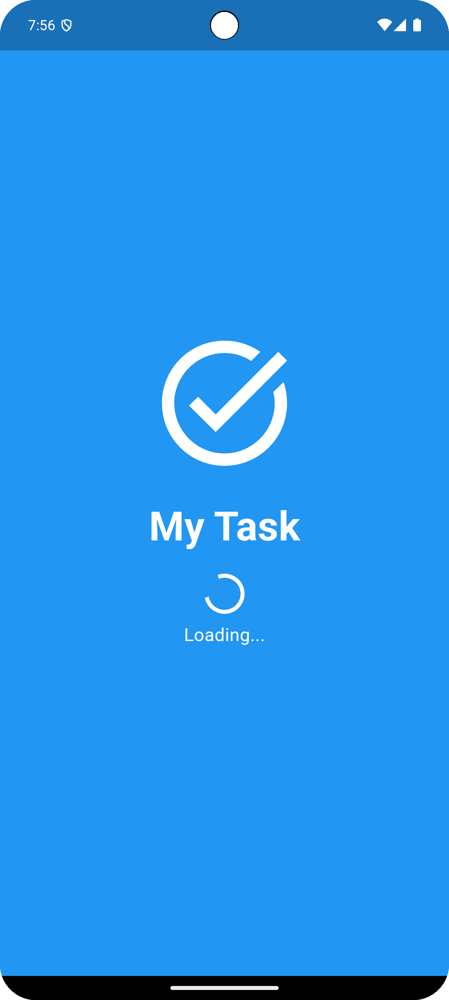
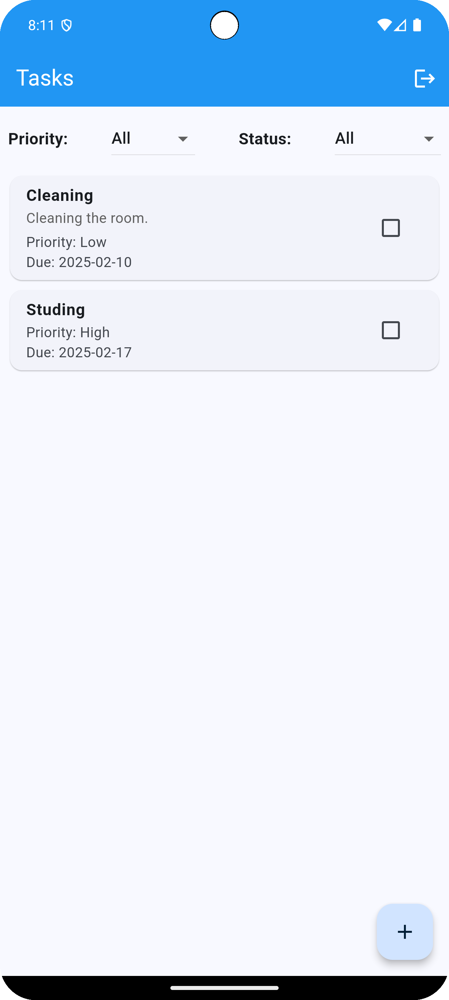
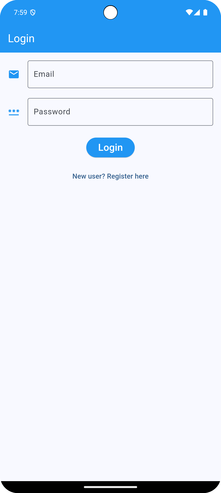
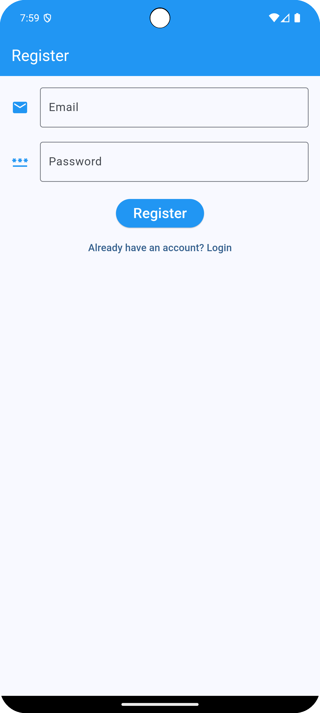
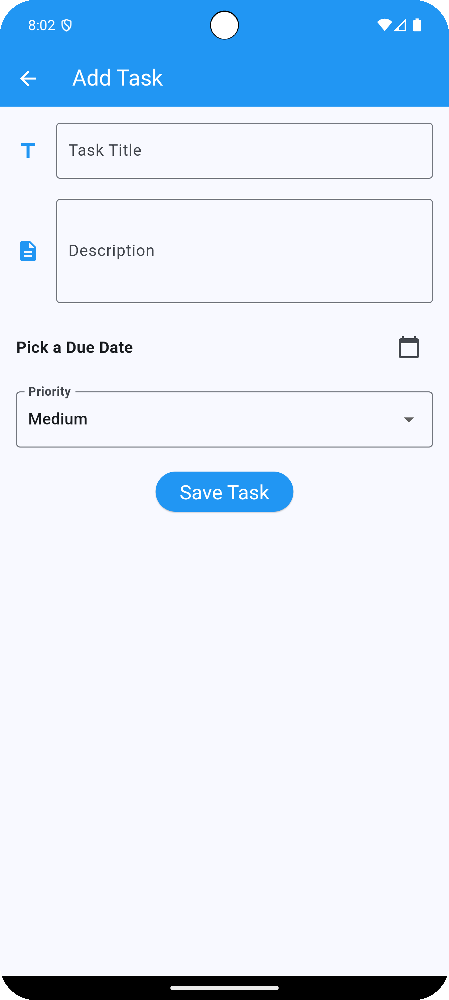

# **📌 Task Manager App**

A simple **task management** application built using **Flutter**, **Riverpod**, **Firebase Authentication**, and **Firestore**. Users can **add, edit, delete, and filter tasks** while keeping their data synced across devices.

---

## **🚀 Features**
✅ **User Authentication** (Login, Register, Logout with Firebase)  
✅ **Add, Edit, Delete Tasks**  
✅ **Mark Tasks as Completed/Incompleted**  
✅ **Task Filtering** (Priority & Status)  
✅ **Real-time Firestore Sync**  

---
## 📸 Screenshots

###  Splash Screen
 

###  Home Screen
  

###  Login Screen
  

###  Register Screen
  

###  Add Task Screen


---
Download APK

Download the latest APK from the following link:  
[Download APK](apk/my_task.apk)

---

## **🛠️ Technologies Used**
- **Flutter** (Latest Version)
- **Riverpod** (State Management)
- **Firebase Authentication**
- **Cloud Firestore** (Database)
- **Intl Package** (Date Formatting)

---

## **📂 Project Structure**
```
📦 my_task_app
 ┣ 📂 lib
 ┃ ┣ 📂 models
 ┃ ┃ ┗ task_model.dart
 ┃ ┣ 📂 providers
 ┃ ┃ ┣ auth_provider.dart
 ┃ ┃ ┗ task_provider.dart
 ┃ ┣ 📂 screens
 ┃ ┃ ┣ splash_screen.dart
 ┃ ┃ ┣ login_screen.dart
 ┃ ┃ ┣ register_screen.dart
 ┃ ┃ ┣ home_screen.dart
 ┃ ┃ ┣ add_edit_task_screen.dart
 ┃ ┃ ┗ auth_checker.dart
 ┃ ┣ 📂 widgets
 ┃ ┃ ┣ task_list.dart
 ┃ ┃ ┗ task_card.dart
 ┃ ┣ main.dart
 ┃ ┗ firebase_options.dart
 ┣ 📜 pubspec.yaml
 ┣ 📜 README.md
 ┗ 📜 .gitignore
```

---

## **⚡ Getting Started**

### **1️⃣ Clone the Repository**
```sh
git clone https://github.com/yourusername/task-manager-app.git
cd task-manager-app
```

### **2️⃣ Install Dependencies**
```sh
flutter pub get
```

### **3️⃣ Run the App**
```sh
flutter run
```

---

